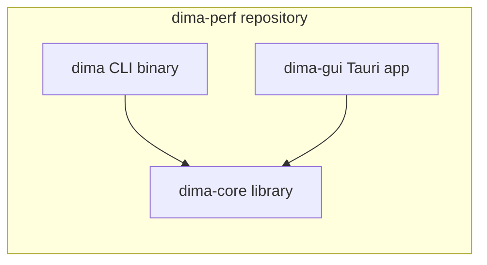
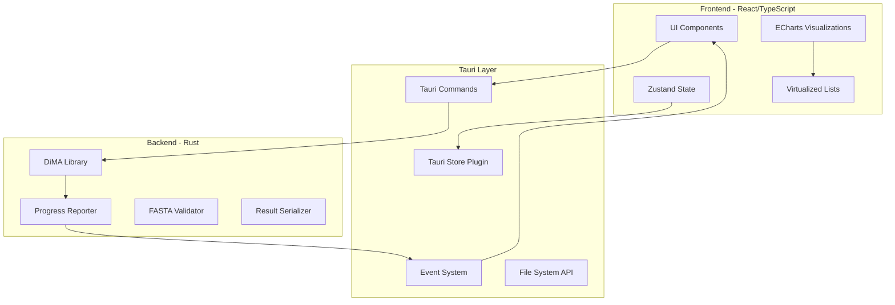

# DiMA Desktop - Tauri UI Application

## Executive Summary

Build a high-performance, cross-platform desktop application (**DiMA Desktop**) using Tauri v2 + React + TypeScript that integrates directly with the DiMA Rust library. The app features project-based organization, a 3-step wizard workflow, synchronized interactive visualizations, rich annotations, and publication-ready exports.

---

## Detailed Requirements Specification

### Application Identity

- **Name:** DiMA Desktop
- **Platforms:** macOS, Windows, Linux
- **Minimum Window Size:** 1024x768
- **Multi-Window:** Supported (each window can have its own analysis)

### Project Management

- **Structure:** One project = one analysis (strictly 1:1)
- **Creation:** Project must be created/named before starting analysis
- **Storage Location:** User's Documents folder (DiMA Desktop/Projects/)
- **Input File Handling:** Prompt to copy input file to project directory (copy is default for portability)
- **Contents:** Results, annotations, layout preferences, filter state
- **Deletion:** Hard delete with confirmation dialog
- **Recent Projects:** Unlimited history with manual clear option

### Startup and First Run

- **First Run:** Welcome message + "Get Started" button
- **Normal Startup:** Recent projects list + "New Analysis" button
- **New Window:** Shows recent projects list
- **Missing Input File:** Show cached results (read-only) or prompt to relocate file

### Wizard Workflow (3 Steps)

1. **Input Step:**
  - Drag-and-drop + file dialog for FASTA selection
  - Auto-validation: file exists, FASTA format, MSA (equal sequence lengths)
  - Auto-detect header format with preview, user confirms/adjusts
  - Recent files list with metadata preview (size, date, sequence count)
  - Back navigation allowed
2. **Configure Step:**
  - All parameters with defaults pre-filled
  - Contextual help: tooltip on hover, detailed popover on click (from CLI help.rs)
  - Header format builder with live parsing preview + warnings
  - Remember last used configuration between sessions
  - Back navigation allowed
3. **Results Step:**
  - Multi-step progress indicator (Reading → Extraction → Entropy → Output)
  - No ETA display
  - Auto-navigate to dashboard on completion
  - Cancel = full cancel (discard all partial work)

### Dashboard and Panels

- **Layout:** Customizable grid (react-grid-layout), positions saved per project
- **Default Panels:** All visible (entropy line, heatmap, position explorer, variant distribution, metadata, HCS)
- **Panel Controls:**
  - Toggle visibility via sidebar/drawer
  - Fullscreen via modal overlay
  - No collapse (only show/hide)
- **Selected Position:** Indicator badge in header area + highlight in charts
- **Chart Synchronization:** On click/select only (not hover)

### Visualizations

**Entropy Line Chart:**

- Always show markers (dots) at each position
- Zoom/pan with dataZoom
- Average entropy reference line
- Highest entropy position highlighted
- Click position → sync with all views

**Entropy Heatmap:**

- Single row gradient visualization
- Click position → select (syncs with other views)

**Variant Distribution:**

- Pie chart (Index, Major, Minor, Unique)
- For currently selected position

**Metadata Charts:**

- Default view: Per-position (selected position's metadata)
- Chart type: Pie/donut
- Show top 10 values + "Other" category

**Position Explorer (Split View):**

- Chart on top, table below
- Variants sorted by motif type (Index → Major → Minor → Unique)
- Paginated: 25 per page default, user-adjustable page size
- Click sequence → detail modal with:
  - Colored sequence (RasMol for protein, standard for nucleotide)
  - Count, incidence, motif type
  - Metadata breakdown (if available)
  - Copy sequence button only

**HCS Visual Map:**

- Colored blocks with sequence on hover/click
- Default threshold: None (show all Index sequences, matching CLI)
- Adjustable threshold slider
- Copy format: FASTA (>HCS_1, >HCS_2, etc.)

### Annotations

- **Colors:** 12 preset colors
- **Content:** Label + note text
- **Chart Display:** Small colored dots above annotated positions
- **Table Display:** Icon indicator with tooltip showing annotation note
- **Editing:** Delete only (cannot edit, must recreate)
- **Storage:** Saved with project

### Search and Filtering

- **Filters:** Position range, sequence substring, entropy range, motif types, low support toggle
- **Persistence:** Saved per project
- **Presets:** Global filter presets (available across all projects)

### Export

- **Data Formats:** JSON, Binary (.dima)
- **Chart Formats:** PNG, SVG at 72 DPI (screen) or 300 DPI (print)
- **Chart Titles:** Editable for export only
- **Naming:**
  - Results: `{project-name}.json`
  - Charts: `{project-name}_{chart-type}.png`
- **Scope:** Full results only (no filtered export)
- **Batch:** One chart at a time

### Theme and Display

- **Theme Toggle:** Light / Dark / System preference
- **Sequence Coloring:**
  - Protein: RasMol color scheme
  - Nucleotide: A=green, T=red, G=yellow, C=blue
- **Position Numbering:** 1-indexed (matching CLI)
- **Decimal Precision:** 4 decimal places (configurable in settings)

### Settings Panel

- **Layout:** Single scrolling page with sections
- **Sections:** Appearance, Display, Analysis Defaults, Export Defaults, Storage
- **Reset Options:**
  - Reset dashboard layout
  - Reset all settings to defaults
- **No import/export of settings**
- **Storage Location:** "Reveal in Finder/Explorer" option

### Error Handling

- **Empty Results:** Empty dashboard with helpful message/illustration
- **Analysis Cancel:** Full cancel, discard partial work
- **Crash Recovery:** Fresh start (no recovery)
- **Window Close with Unsaved:** Prompt to save

### Help and Documentation

- **Parameter Help:** Tooltip on hover, detailed popover on click
- **No first-time tour**
- **No external documentation links**

### Accessibility

- **Keyboard navigation:** Arrow keys for positions + 'Go to position' input
- **Basic accessibility only (semantic HTML)**
- **No color-blind mode**

### Analytics

- **No analytics collection**

### Testing

- **Strategy:** Unit tests + integration tests
- **Sample Data:** Use `samples/mers_spike_aa.fasta` for testing

---

## Additional Specifications (Detailed)

### Navigation: Sidebar-Only Approach

- **No traditional menu bar** - sidebar handles all navigation
- **Sidebar width:** ~350px when expanded
- **Collapsed mode:** Icons with tooltips
- **Toggle:** Button at bottom of sidebar
- **Always visible:** Collapsible to icons, never fully hidden

**Sidebar Sections:**

1. **Projects:** "New Analysis" button + scrollable recent projects (sorted by last opened)
2. **Settings:** Opens settings panel in main content area
3. **About:** Version info, developer console access (Help → Developer Console)

### Header Format Builder (Tag Builder)

- **UI:** Tag/chip builder with drag-to-reorder
- **Field source:** Auto-suggest from detected values + custom input
- **Preview:** 3 sample headers with live parsing
- **Warnings:** Show if headers don't match format

### Position Navigation

- **Single position selection only**
- **Keyboard:** Arrow keys to navigate
- **Go to position:** Input in header bar
- **Invalid position:** Inline error message

### Charts

- **Legend position:** Bottom
- **Heatmap scale:** Fixed (blue to red)
- **Zoom reset:** Double-click or button

### Variant Table

- **Columns:** Sequence, Count, Incidence, Motif
- **Column resize:** Auto-fit with manual option
- **Row height:** Fixed

### Copy Format

- **Sequence:** FASTA format ('>Position_N\nSEQUENCE')

### Filter Presets

- **Simple list:** Save, select, delete
- **Save:** Button with name prompt

### File Association

- **.dima files:** Prompt to import to new project

### System Integration

- **Dock badge:** Progress during analysis
- **Window state:** Remember size only
- **Developer console:** Via sidebar About section

### Validation

- **MSA:** Equal lengths only
- **Sample:** 100 sequences (10 first + 90 random)
- **Errors:** With location info

### Performance

- **Loading:** All at once with skeleton
- **Memory:** Lazy-load variants on expand

### Other

- **No context menus, undo/redo, print, i18n**
- **No version check** - manual GitHub check

---

## CLI and GUI Coexistence

**Important:** Both CLI and GUI will coexist in the same repository. The existing CLI binary (`dima`) remains fully functional and independent.




**Workspace Structure:**

- The root `Cargo.toml` becomes a workspace with two members
- `dima` (CLI): Existing binary, continues to work exactly as before
- `dima-gui` (Tauri): New GUI app that imports the shared library

**Build Commands:**

- `cargo build --release` - Builds CLI only (default member)
- `cargo build --release -p dima-gui` - Builds GUI only
- `cargo build --release --workspace` - Builds both

---

## Architecture Overview




---

## Repository Structure

The Tauri app will be added to the existing repository. **The existing CLI remains unchanged and fully functional.**

```
dima-perf/                    # Repository root
├── src/                      # Existing Rust CLI source (UNCHANGED)
│   ├── main.rs               # CLI entry point (PRESERVED)
│   ├── lib.rs                # Library exports (ENHANCED with progress trait)
│   ├── analysis.rs           # Core analysis (ENHANCED with progress callback)
│   └── ...                   # All other files remain unchanged
│
├── src-tauri/                # NEW: Tauri Rust backend
│   ├── Cargo.toml            # Workspace member, depends on dima-lib
│   ├── src/
│   │   ├── main.rs           # Tauri entry point
│   │   ├── commands/         # Tauri command handlers
│   │   │   ├── mod.rs
│   │   │   ├── analyze.rs    # Analysis commands
│   │   │   ├── validate.rs   # FASTA validation + MSA check
│   │   │   ├── project.rs    # Project management
│   │   │   └── export.rs     # Export handlers
│   │   ├── state.rs          # App state management
│   │   ├── progress.rs       # Progress event emitter
│   │   └── project.rs        # Project file operations
│   └── tauri.conf.json
│
├── ui/                       # React frontend
│   ├── package.json
│   ├── tsconfig.json
│   ├── vite.config.ts
│   ├── src/
│   │   ├── main.tsx
│   │   ├── App.tsx
│   │   ├── components/
│   │   │   ├── ui/           # shadcn components
│   │   │   ├── wizard/       # Wizard step components
│   │   │   ├── charts/       # ECharts wrappers
│   │   │   ├── dashboard/    # Dashboard grid components
│   │   │   ├── annotations/  # Annotation components
│   │   │   └── common/       # Shared components
│   │   ├── hooks/            # Custom React hooks
│   │   ├── stores/           # Zustand state stores
│   │   ├── lib/              # Utilities, types, helpers
│   │   │   ├── tauri.ts      # Tauri API wrappers
│   │   │   ├── types.ts      # TypeScript types mirroring Rust
│   │   │   ├── colors.ts     # RasMol + nucleotide color schemes
│   │   │   └── filters.ts    # Filter presets management
│   │   └── styles/           # Global styles, themes
│   └── public/
│
├── samples/                  # Existing sample files
│   └── mers_spike_aa.fasta   # Test data for integration tests
│
├── Cargo.toml                # Updated to workspace
└── Cargo.lock
```

## User Data Structure (Documents Folder)

```
~/Documents/DiMA Desktop/
├── Projects/
│   ├── my-analysis-2026-01-31/
│   │   ├── project.json           # Project metadata
│   │   ├── input.fasta            # Copied input file (optional)
│   │   ├── results.json           # Analysis results (cached)
│   │   ├── annotations.json       # User annotations
│   │   └── layout.json            # Dashboard layout preferences
│   └── another-project/
│       └── ...
├── settings.json                  # App settings
├── recent-projects.json           # Recent projects list
└── filter-presets.json            # Global filter presets
```

---

## Phase 1: Foundation Setup

### 1.1 Rust Workspace Configuration

Convert the project to a Cargo workspace while preserving CLI as the default:

```toml
# Root Cargo.toml (updated)
[workspace]
members = [".", "src-tauri"]
default-members = ["."]  # CLI is the default, so `cargo build` still builds CLI

[workspace.dependencies]
serde = { version = "1.0", features = ["derive"] }
serde_json = "1.0"

# Existing package configuration remains...
[package]
name = "dima"
version = "0.1.0"
# ...

# Add library target alongside existing binary
[lib]
name = "dima_lib"
path = "src/lib.rs"

[[bin]]
name = "dima"
path = "src/main.rs"
```

**Key points:**

- `default-members = ["."]` ensures `cargo build` only builds CLI (backward compatible)
- The library target (`dima_lib`) exposes core functionality for the GUI
- The binary target (`dima`) remains the CLI entry point
- Existing `cargo build --release` commands work exactly as before

### 1.2 Tauri Backend Setup

Create `src-tauri/` with Tauri v2:

**Key dependencies:**

- `tauri` v2 with plugins: dialog, fs, store, shell
- Direct dependency on the dima crate (path = "..")
- `tokio` for async operations
- `tauri-plugin-store` for settings persistence

### 1.3 Frontend Setup

Initialize React app in `ui/`:

**Key dependencies:**

- React 18 + TypeScript 5
- Vite for bundling
- Tailwind CSS + shadcn/ui components
- ECharts + echarts-for-react
- Zustand for state management
- react-grid-layout for customizable dashboard
- @tanstack/react-virtual for virtualized lists
- @tauri-apps/api v2

---

## Phase 2: Core Backend Integration

### 2.1 Tauri Commands

Expose DiMA functionality via Tauri commands:

```rust
// src-tauri/src/commands/analyze.rs

#[tauri::command]
async fn validate_fasta(
    path: String,
    alphabet: String,
) -> Result<FastaValidation, String>;

#[tauri::command]
async fn run_analysis(
    window: Window,
    config: AnalysisConfig,
) -> Result<AnalysisResult, String>;

#[tauri::command]
fn cancel_analysis(state: State<AppState>) -> Result<(), String>;

#[tauri::command]
async fn export_results(
    results: AnalysisResult,
    format: ExportFormat,
    path: String,
) -> Result<(), String>;
```

### 2.2 Progress Reporting

Modify the DiMA library to emit progress events. The current CLI uses `indicatif` progress bars - we'll add a trait-based progress reporter:

```rust
// In dima lib: src/progress.rs

pub trait ProgressReporter: Send + Sync {
    fn report(&self, progress: ProgressUpdate);
}

pub struct ProgressUpdate {
    pub stage: AnalysisStage,
    pub current: usize,
    pub total: usize,
    pub message: String,
    pub throughput: Option<f64>,  // sequences/sec
}
```

The Tauri backend will implement this trait to emit events:

```rust
// src-tauri/src/progress.rs

struct TauriProgressReporter {
    window: Window,
}

impl ProgressReporter for TauriProgressReporter {
    fn report(&self, progress: ProgressUpdate) {
        self.window.emit("analysis-progress", progress).ok();
    }
}
```

### 2.3 FASTA Validation

Create a dedicated validation command that:

1. Checks file exists and is readable
2. Parses first few sequences to verify FASTA format
3. Checks sequence lengths match (MSA validation)
4. Returns preview info (sequence count estimate, length, sample headers)

```rust
pub struct FastaValidation {
    pub is_valid: bool,
    pub sequence_count: usize,
    pub sequence_length: usize,
    pub sample_headers: Vec<String>,
    pub detected_alphabet: String,
    pub errors: Vec<ValidationError>,
}
```

---

## Phase 3: Frontend Architecture

### 3.1 State Management

Use Zustand with persistence for app state:

```typescript
// ui/src/stores/analysisStore.ts

interface AnalysisStore {
  // Wizard state
  currentStep: 'input' | 'configure' | 'results';
  
  // Input state
  inputFile: FileInfo | null;
  validation: FastaValidation | null;
  
  // Configuration
  config: AnalysisConfig;
  
  // Results
  results: AnalysisResult | null;
  isAnalyzing: boolean;
  progress: ProgressUpdate | null;
  
  // Actions
  setInputFile: (file: FileInfo) => void;
  updateConfig: (partial: Partial<AnalysisConfig>) => void;
  startAnalysis: () => Promise<void>;
  // ...
}
```

### 3.2 Type Definitions

Mirror Rust types in TypeScript:

```typescript
// ui/src/lib/types.ts

interface AnalysisResult {
  sequence_count: number;
  support_threshold: number;
  low_support_count: number;
  query_name: string;
  kmer_length: number;
  highest_entropy: HighestEntropy;
  average_entropy: number;
  results: Position[];
}

interface Position {
  position: number;
  low_support: string | null;
  entropy: number;
  support: number;
  distinct_variants_count: number;
  distinct_variants_incidence: number;
  total_variants_incidence: number;
  diversity_motifs: Variant[] | null;
}

interface Variant {
  sequence: string;
  count: number;
  incidence: number;
  motif_short: string | null;
  motif_long: string | null;
  metadata: Record<string, Record<string, number>> | null;
}
```

---

## Phase 4: Wizard UI Implementation

### 4.0 Project Creation (Before Wizard)

Before entering the wizard, user must create a project:

Components:

- **ProjectNameInput**: Text input for project name
- **ProjectList**: Recent projects (for reference)

Flow:

1. User clicks "New Analysis" from startup screen
2. Project name dialog appears
3. User enters name, clicks "Create"
4. Project folder created in Documents/DiMA Desktop/Projects/
5. Wizard Step 1 appears

### 4.1 Step 1: Input

Components:

- **FileDropZone**: Drag-and-drop area with file dialog fallback
- **RecentFilesPanel**: Recent files with metadata preview (size, date, sequence count)
- **FilePreview**: Shows validation results, sequence preview
- **CopyFilePrompt**: Ask if user wants to copy file to project (default: yes)
- **HeaderFormatDetector**: Auto-detect and preview header format
- **AlphabetSelector**: Protein/Nucleotide toggle

Flow:

1. User drops/selects FASTA file
2. Validation runs automatically (format + MSA check)
3. Header format auto-detected, preview shown
4. User confirms/adjusts header format
5. Prompt to copy file to project (copy is default)
6. Preview shows: file size, sequence count, length, sample headers
7. Next button enabled when validation passes
8. Back button returns to project list

### 4.2 Step 2: Configure

Components:

- **ParameterForm**: All CLI parameters with defaults pre-filled
- **ParameterHelp**: Tooltip on hover, detailed popover on click (from help.rs)
- **HeaderFormatBuilder**: Visual builder with live parsing preview
- **HeaderFormatPreview**: Shows how sample headers parse with warnings
- **MetadataFieldSelector**: Checkboxes to select which fields to aggregate

Parameters with contextual help (all have info icons):

- K-mer length (default: 9)
- Support threshold (default: 30)
- Query name (defaults to project name)
- Alphabet (protein/nucleotide, auto-detected)
- Header format (pre-filled from auto-detection)
- Metadata fields selection
- Validation mode (strict/permissive/report)
- Allow lowercase toggle
- HCS options (enable, threshold)

**Last Used Config**: Remembered between sessions, auto-filled on new analysis

Flow:

1. Parameters pre-filled with defaults (or last used config)
2. User adjusts parameters as needed
3. Header format preview updates live showing parsed fields
4. Warnings shown if any headers don't match format
5. Back button returns to Input step
6. Next button starts analysis

### 4.3 Step 3: Results

**During Analysis:**

Components:

- **MultiStepProgress**: Visual indicator showing stages:
  - Reading FASTA
  - K-mer Extraction
  - Entropy Calculation
  - Output Generation
- **CurrentStageIndicator**: Highlighted current stage with spinner
- **CancelButton**: Cancels analysis (full cancel, discard partial)

**After Analysis Complete:**

Components:

- **ResultsDashboard**: Customizable grid of visualizations
- **PositionIndicator**: Badge showing currently selected position
- **PanelToggleSidebar**: Drawer to show/hide panels
- **AnnotationManager**: Add/view/delete annotations
- **ExportPanel**: Export charts and data

Flow:

1. Analysis starts, multi-step progress shown
2. On complete, auto-navigate to dashboard
3. All panels visible by default
4. User can customize layout (saved per project)
5. Click position in any chart → syncs all views
6. Selected position badge appears in header

---

## Phase 5: Visualization Components

### 5.1 Entropy Line Chart

```typescript
// ECharts configuration for entropy vs position

const entropyLineOptions = {
  tooltip: { trigger: 'axis' },
  dataZoom: [
    { type: 'inside', xAxisIndex: 0 },
    { type: 'slider', xAxisIndex: 0 }
  ],
  xAxis: { type: 'value', name: 'Position' },
  yAxis: { type: 'value', name: 'Entropy' },
  series: [{
    type: 'line',
    data: positions.map(p => [p.position, p.entropy]),
    smooth: false,
    lineStyle: { width: 1 }
  }]
};
```

Features:

- Zoom/pan with dataZoom
- Click position → sync with position explorer
- Brushing to select range
- Average entropy reference line
- Highlight highest entropy position

### 5.2 Entropy Heatmap

Single-row heatmap showing entropy gradient across all positions:

```typescript
const heatmapOptions = {
  visualMap: {
    min: 0,
    max: maxEntropy,
    calculable: true,
    orient: 'horizontal',
    inRange: { color: ['#313695', '#4575b4', '#74add1', '#abd9e9', '#e0f3f8', '#fee090', '#fdae61', '#f46d43', '#d73027', '#a50026'] }
  },
  xAxis: { type: 'category', data: positions.map(p => p.position) },
  yAxis: { type: 'category', data: ['Entropy'] },
  series: [{
    type: 'heatmap',
    data: positions.map((p, i) => [i, 0, p.entropy])
  }]
};
```

### 5.3 Variant Distribution Chart

Pie/bar chart showing motif type distribution for selected position:

```typescript
const motifDistributionOptions = {
  series: [{
    type: 'pie',
    data: [
      { value: indexCount, name: 'Index', itemStyle: { color: '#4CAF50' } },
      { value: majorCount, name: 'Major', itemStyle: { color: '#2196F3' } },
      { value: minorCount, name: 'Minor', itemStyle: { color: '#FF9800' } },
      { value: uniqueCount, name: 'Unique', itemStyle: { color: '#9E9E9E' } }
    ]
  }]
};
```

### 5.4 Metadata Charts

For each metadata field (country, date, host, etc.):

- Bar chart showing distribution
- Drill-down from global → position → variant level
- Stacked view option for comparing across motif types

### 5.5 Position Explorer (Split View)

Layout:

```
┌─────────────────────────────────────────┐
│  Entropy Chart (top)                    │
│  - Click/hover syncs with table below   │
├─────────────────────────────────────────┤
│  Position Table (bottom)                │
│  - Virtualized scrolling                │
│  - Expandable rows for variant details  │
│  - Search/filter controls               │
└─────────────────────────────────────────┘
```

Table columns:

- Position
- Entropy (with mini sparkline)
- Support
- Low Support indicator
- Variant counts by motif type
- Expand button for variant details

### 5.6 HCS Visual Map

Visual representation showing conserved regions:

```
Position:  1    50   100  150  200  250  ...
           ████████████░░░████░░░████████
           HCS Region 1   HCS 2   HCS 3
```

Features:

- Click region to see sequence
- Adjustable threshold slider
- Export selected sequences

### 5.7 RasMol Color Scheme

Implement standard bioinformatics coloring for amino acids:

```typescript
// ui/src/lib/colors.ts

export const RASMOL_COLORS: Record<string, string> = {
  'D': '#E60A0A', 'E': '#E60A0A',  // Acidic - Red
  'K': '#145AFF', 'R': '#145AFF',  // Basic - Blue
  'H': '#8282D2',                   // Histidine - Pale blue
  'F': '#3232AA', 'Y': '#3232AA', 'W': '#B45AB4',  // Aromatic
  'C': '#E6E600', 'M': '#E6E600',  // Sulfur - Yellow
  'S': '#FA9600', 'T': '#FA9600',  // Hydroxyl - Orange
  'N': '#00DCDC', 'Q': '#00DCDC',  // Amide - Cyan
  'G': '#EBEBEB',                   // Glycine - Light gray
  'P': '#DC9682',                   // Proline - Flesh
  'A': '#C8C8C8', 'V': '#0F820F', 'L': '#0F820F', 
  'I': '#0F820F',                   // Aliphatic - Green
  // ... etc
};

export function colorizeSequence(sequence: string): JSX.Element {
  return (
    <span className="font-mono">
      {sequence.split('').map((char, i) => (
        <span key={i} style={{ color: RASMOL_COLORS[char] || '#888' }}>
          {char}
        </span>
      ))}
    </span>
  );
}
```

---

## Phase 6: Dashboard Customization

### 6.1 Grid Layout

Use `react-grid-layout` for customizable dashboard:

```typescript
// ui/src/components/dashboard/DashboardGrid.tsx

const defaultLayout = [
  { i: 'entropy-line', x: 0, y: 0, w: 12, h: 4 },
  { i: 'entropy-heatmap', x: 0, y: 4, w: 12, h: 2 },
  { i: 'position-explorer', x: 0, y: 6, w: 8, h: 6 },
  { i: 'variant-distribution', x: 8, y: 6, w: 4, h: 3 },
  { i: 'metadata-charts', x: 8, y: 9, w: 4, h: 3 },
  { i: 'hcs-map', x: 0, y: 12, w: 12, h: 3 },
];
```

Features:

- Drag to reposition panels
- Resize handles on each panel
- Show/hide panels via menu
- Save layout to Tauri store
- Reset to default layout option

### 6.2 Layout Persistence

```typescript
// ui/src/stores/layoutStore.ts

interface LayoutStore {
  layout: Layout[];
  hiddenPanels: string[];
  
  updateLayout: (layout: Layout[]) => void;
  togglePanel: (panelId: string) => void;
  resetLayout: () => void;
}

// Persisted via tauri-plugin-store
```

---

## Phase 7: Search and Filtering

### 7.1 Advanced Search Panel

Components:

- Position range input (from - to)
- Sequence search (substring match in k-mers)
- Entropy range slider (min - max)
- Motif type checkboxes (Index, Major, Minor, Unique)
- Low support filter toggle

```typescript
interface SearchFilters {
  positionRange: [number, number] | null;
  sequenceQuery: string;
  entropyRange: [number, number] | null;
  motifTypes: MotifType[];
  includeLowSupport: boolean;
}
```

### 7.2 Filtering Implementation

Filters applied client-side for instant feedback:

```typescript
function filterPositions(
  positions: Position[],
  filters: SearchFilters
): Position[] {
  return positions.filter(pos => {
    if (filters.positionRange) {
      if (pos.position < filters.positionRange[0] || 
          pos.position > filters.positionRange[1]) return false;
    }
    if (filters.entropyRange) {
      if (pos.entropy < filters.entropyRange[0] || 
          pos.entropy > filters.entropyRange[1]) return false;
    }
    // ... more filters
    return true;
  });
}
```

---

## Phase 8: Export Capabilities

### 8.1 Chart Export

Publication-ready export options:

```typescript
interface ChartExportOptions {
  format: 'png' | 'svg' | 'pdf';
  width: number;
  height: number;
  dpi: number;  // For print quality
  backgroundColor: 'white' | 'transparent';
  title: string | null;
  includeLegend: boolean;
  fontFamily: string;
  fontSize: number;
}
```

ECharts provides built-in export via `getDataURL()` and `getConnectedDataURL()`.

### 8.2 Data Export

```typescript
interface DataExportOptions {
  format: 'json' | 'dima';
  includeMetadata: boolean;
  prettyPrint: boolean;  // For JSON
  compression: 0 | 1 | 2;  // For .dima
}
```

### 8.3 Export Dialog

Modal with:

- Format selection
- Quality/size options
- Preview (for charts)
- File path selection via Tauri dialog

---

## Phase 8: Annotations System

### 8.1 Annotation Model

```typescript
interface Annotation {
  id: string;
  positionNumber: number;
  color: AnnotationColor;  // One of 12 preset colors
  label: string;           // Short label (optional)
  note: string;            // Detailed note
  createdAt: Date;
}

type AnnotationColor = 
  | 'red' | 'orange' | 'amber' | 'yellow' 
  | 'lime' | 'green' | 'teal' | 'cyan' 
  | 'blue' | 'indigo' | 'purple' | 'pink';
```

### 8.2 Annotation UI

**Creating Annotations:**

- Right-click position in table or chart → "Add Annotation"
- Modal with color picker (12 presets), label input, note textarea
- Save → annotation appears immediately

**Viewing Annotations:**

- Charts: Small colored dot above annotated positions
- Table: Icon indicator in dedicated column, tooltip shows note
- Annotations Panel: List of all annotations with quick navigation

**Deleting Annotations:**

- Click annotation icon → popover with note preview + delete button
- Confirmation dialog before delete

### 8.3 Annotation Persistence

Annotations saved to `{project-folder}/annotations.json`:

```json
{
  "annotations": [
    {
      "id": "ann-1",
      "positionNumber": 484,
      "color": "red",
      "label": "Mutation site",
      "note": "This position shows high variability...",
      "createdAt": "2026-01-31T10:00:00Z"
    }
  ]
}
```

---

## Phase 9: Export Capabilities

### 9.1 Chart Export

Components:

- **ExportDialog**: Modal for export options
- **ChartPreview**: Preview before export

Options:

- Format: PNG or SVG
- Resolution: 72 DPI (screen) or 300 DPI (print quality)
- Title: Editable for export only
- Background: White (for publication)

Filename: `{project-name}_{chart-type}.png`

### 9.2 Data Export

Formats:

- JSON: Pretty-printed, full results
- Binary: .dima format (LZ4 compression by default)

Filename: `{project-name}.json` or `{project-name}.dima`

### 9.3 Export Flow

1. Click Export button (in header or panel)
2. Export dialog opens
3. Choose format, resolution, title
4. Preview updates (for charts)
5. Choose save location (respects default output directory setting)
6. Export → Success modal

---

## UI Feedback and Loading States

### Loading States

- **Skeleton loaders**: Used for panels loading data
- **Spinners**: Used for quick operations

### Success Feedback

- **Modal dialogs**: For important actions (export complete, analysis done)

### Empty States

- **Illustration + text**: For empty lists, no results
- **Actionable**: Include "Get Started" or "Create" buttons where appropriate

### Error States

- **Simple error messages**: Clear, concise error descriptions
- **Empty dashboard**: For no-results scenarios with helpful message

---

## Phase 10: Theme and Styling

### 10.1 Theme System

```typescript
// ui/src/stores/themeStore.ts

type ThemeMode = 'light' | 'dark' | 'system';

interface ThemeStore {
  mode: ThemeMode;
  setMode: (mode: ThemeMode) => void;
  effectiveTheme: 'light' | 'dark';  // Resolved from system if needed
}
```

### 10.2 CSS Variables

```css
/* ui/src/styles/themes.css */

:root {
  --chart-bg: #ffffff;
  --chart-grid: #e5e5e5;
  --chart-text: #333333;
  --entropy-low: #313695;
  --entropy-high: #a50026;
}

.dark {
  --chart-bg: #1a1a1a;
  --chart-grid: #333333;
  --chart-text: #e5e5e5;
}
```

### 10.3 Sequence Color Schemes

**Protein (RasMol):**

```typescript
export const RASMOL_COLORS: Record<string, string> = {
  'D': '#E60A0A', 'E': '#E60A0A',  // Acidic - Red
  'K': '#145AFF', 'R': '#145AFF',  // Basic - Blue
  'H': '#8282D2',                   // Histidine - Pale blue
  'F': '#3232AA', 'Y': '#3232AA',  // Aromatic
  'W': '#B45AB4',                   // Tryptophan
  'C': '#E6E600', 'M': '#E6E600',  // Sulfur - Yellow
  'S': '#FA9600', 'T': '#FA9600',  // Hydroxyl - Orange
  'N': '#00DCDC', 'Q': '#00DCDC',  // Amide - Cyan
  'G': '#EBEBEB',                   // Glycine - Light gray
  'P': '#DC9682',                   // Proline - Flesh
  'A': '#C8C8C8',                   // Alanine - Light gray
  'V': '#0F820F', 'L': '#0F820F',  // Aliphatic - Green
  'I': '#0F820F',                   // Isoleucine - Green
};
```

**Nucleotide (Standard):**

```typescript
export const NUCLEOTIDE_COLORS: Record<string, string> = {
  'A': '#33CC33',  // Adenine - Green
  'T': '#CC3333',  // Thymine - Red
  'U': '#CC3333',  // Uracil - Red (same as T)
  'G': '#CCCC33',  // Guanine - Yellow
  'C': '#3333CC',  // Cytosine - Blue
};
```

### 10.4 Display Settings

```typescript
interface DisplaySettings {
  decimalPrecision: number;  // Default: 4, configurable
  positionNumbering: '1-indexed';  // Fixed, matching CLI
}
```

---

## Phase 11: Settings and Persistence

### 11.1 Settings Panel

Single scrolling page with sections, accessible via settings icon in header:

**Appearance Section:**

- Theme toggle (light/dark/system)
- Decimal precision (default: 4)

**Analysis Defaults Section:**

- Default k-mer length
- Default support threshold
- Default validation mode

**Export Defaults Section:**

- Default output directory (user-configurable)
- Default chart resolution (72 or 300 DPI)

**Storage Section:**

- Projects location: ~/Documents/DiMA Desktop/Projects/
- "Reveal in Finder/Explorer" button
- Clear cached results button

**Reset Section:**

- Reset dashboard layout button
- Reset all settings to defaults button

**About Section:**

- Version info
- (No external links)

### 11.2 Persistence Strategy

Files stored in ~/Documents/DiMA Desktop/:

```typescript
// settings.json
interface AppSettings {
  theme: ThemeMode;
  decimalPrecision: number;
  defaultOutputDirectory: string;
  defaultChartDPI: 72 | 300;
  defaultKmerLength: number;
  defaultSupportThreshold: number;
  defaultValidationMode: 'strict' | 'permissive' | 'report';
  lastUsedConfig: Partial<AnalysisConfig>;
}

// recent-projects.json
interface RecentProjects {
  projects: Array<{
    name: string;
    path: string;
    lastOpened: string;
    inputFileName: string;
    sequenceCount: number;
  }>;
}

// filter-presets.json (global)
interface FilterPresets {
  presets: Array<{
    id: string;
    name: string;
    filters: SearchFilters;
  }>;
}
```

### 11.3 Per-Project Persistence

Each project folder contains:

```typescript
// project.json
interface ProjectMetadata {
  name: string;
  createdAt: string;
  inputFile: {
    originalPath: string;
    copiedToProject: boolean;
    fileName: string;
  };
  config: AnalysisConfig;
}

// results.json - Analysis results (cached)
// annotations.json - User annotations
// layout.json - Dashboard layout preferences
// filters.json - Per-project filter state
```

---

## Phase 12: Performance Optimizations

### 12.1 Virtualized Scrolling

For position tables with thousands of rows:

```typescript
import { useVirtualizer } from '@tanstack/react-virtual';

function PositionTable({ positions }: { positions: Position[] }) {
  const parentRef = useRef<HTMLDivElement>(null);
  
  const virtualizer = useVirtualizer({
    count: positions.length,
    getScrollElement: () => parentRef.current,
    estimateSize: () => 48,  // Row height
    overscan: 20,  // Buffer rows
  });
  
  return (
    <div ref={parentRef} className="h-full overflow-auto">
      <div style={{ height: virtualizer.getTotalSize() }}>
        {virtualizer.getVirtualItems().map(virtualRow => (
          <PositionRow 
            key={virtualRow.key}
            position={positions[virtualRow.index]}
            style={{ transform: `translateY(${virtualRow.start}px)` }}
          />
        ))}
      </div>
    </div>
  );
}
```

### 12.2 Paginated Variant Lists

For positions with many variants:

```typescript
interface PaginationState {
  pageSize: number;      // Default: 25, user-adjustable
  currentPage: number;
  totalItems: number;
}

// Page size options: 10, 25, 50, 100
```

All variants are loaded (for virtualization), but displayed in pages for better UX.

### 12.3 Chart Optimization

ECharts canvas rendering handles large datasets well, but add:

- `large: true` for line charts with 1000+ points
- `sampling: 'lttb'` for downsampling when zoomed out
- Debounce updates during resize

---

## Phase 13: Cross-Platform Considerations

### 13.1 Platform-Specific Handling

- **macOS**: Native menu bar integration, title bar styling, Window menu
- **Windows**: Custom title bar, proper DPI scaling
- **Linux**: GTK/AppIndicator support

### 13.2 Multi-Window Support

- Multiple windows allowed (each with own analysis)
- New window shows recent projects list
- OS default window management (Window menu on macOS)

### 13.3 Build Configuration

```json
// src-tauri/tauri.conf.json
{
  "bundle": {
    "targets": ["dmg", "app", "msi", "nsis", "deb", "rpm", "appimage"]
  }
}
```

---

## Phase 14: CI/CD Workflow Updates

The existing `.github/workflows/release.yml` will be updated to build and release both CLI and GUI.

### 14.1 Updated Workflow Structure

```yaml
# .github/workflows/release.yml (updated)

jobs:
  # Job 1: Build CLI (existing, mostly unchanged)
  build-cli:
    name: Build CLI ${{ matrix.target }}
    # ... existing CLI build matrix for all 8 targets
    # Outputs: dima-{version}-{target}.tar.gz / .zip

  # Job 2: Build GUI (new)
  build-gui:
    name: Build GUI ${{ matrix.target }}
    runs-on: ${{ matrix.os }}
    strategy:
      matrix:
        include:
          - target: x86_64-unknown-linux-gnu
            os: ubuntu-22.04
          - target: aarch64-unknown-linux-gnu
            os: ubuntu-22.04
          - target: x86_64-apple-darwin
            os: macos-13
          - target: aarch64-apple-darwin
            os: macos-14
          - target: x86_64-pc-windows-msvc
            os: windows-latest
    steps:
      - uses: actions/checkout@v4
      - uses: dtolnay/rust-toolchain@stable
      - uses: pnpm/action-setup@v2  # or npm
      - uses: actions/setup-node@v4
      
      # Install Tauri dependencies (Linux)
      - name: Install Linux dependencies
        if: runner.os == 'Linux'
        run: |
          sudo apt-get update
          sudo apt-get install -y libwebkit2gtk-4.1-dev libappindicator3-dev librsvg2-dev
      
      # Build frontend
      - name: Install frontend dependencies
        run: pnpm install
        working-directory: ui
      
      - name: Build frontend
        run: pnpm build
        working-directory: ui
      
      # Build Tauri app
      - name: Build Tauri
        uses: tauri-apps/tauri-action@v0
        with:
          projectPath: src-tauri
    # Outputs: dima-gui-{version}.dmg, .msi, .deb, .AppImage, etc.

  # Job 3: Update release notes (updated)
  update-release:
    needs: [build-cli, build-gui]
    # ... generates combined download table for CLI and GUI
```

### 14.2 Release Assets Structure

Each release will include:

**CLI Binaries (existing):**

- `dima-{version}-x86_64-unknown-linux-gnu.tar.gz`
- `dima-{version}-x86_64-unknown-linux-musl.tar.gz`
- `dima-{version}-aarch64-unknown-linux-gnu.tar.gz`
- `dima-{version}-aarch64-unknown-linux-musl.tar.gz`
- `dima-{version}-x86_64-apple-darwin.tar.gz`
- `dima-{version}-aarch64-apple-darwin.tar.gz`
- `dima-{version}-x86_64-pc-windows-msvc.zip`
- `dima-{version}-aarch64-pc-windows-msvc.zip`

**GUI Applications (new):**

- `DiMA-{version}-x86_64.dmg` (macOS Intel)
- `DiMA-{version}-aarch64.dmg` (macOS Apple Silicon)
- `DiMA-{version}-x64-setup.exe` (Windows installer)
- `DiMA-{version}-x64.msi` (Windows MSI)
- `DiMA-{version}-amd64.deb` (Debian/Ubuntu)
- `DiMA-{version}-x86_64.rpm` (Fedora/RHEL)
- `DiMA-{version}-x86_64.AppImage` (Universal Linux)

### 14.3 Updated Release Notes

The release body will include two sections:

```markdown
## DiMA CLI

Download the command-line tool:

| Platform | Architecture | Download |
|----------|--------------|----------|
| Linux | x86_64 | [dima-v1.0.0-x86_64-unknown-linux-gnu.tar.gz](...) |
| ... | ... | ... |

## DiMA GUI

Download the desktop application:

| Platform | Download |
|----------|----------|
| macOS (Intel) | [DiMA-1.0.0-x86_64.dmg](...) |
| macOS (Apple Silicon) | [DiMA-1.0.0-aarch64.dmg](...) |
| Windows | [DiMA-1.0.0-x64-setup.exe](...) |
| Linux (Debian/Ubuntu) | [DiMA-1.0.0-amd64.deb](...) |
| Linux (AppImage) | [DiMA-1.0.0-x86_64.AppImage](...) |
```

### 14.4 Tauri Build Dependencies

Linux CI runners need additional dependencies for Tauri:

```yaml
- name: Install Tauri dependencies (Ubuntu)
  run: |
    sudo apt-get update
    sudo apt-get install -y \
      libwebkit2gtk-4.1-dev \
      libappindicator3-dev \
      librsvg2-dev \
      patchelf
```

### 14.5 Signing and Notarization (Optional)

For production releases, add code signing:

**macOS:**

- Apple Developer certificate for signing
- Notarization via `xcrun notarytool`
- Tauri handles this with `APPLE_CERTIFICATE` secrets

**Windows:**

- Code signing certificate
- Tauri handles with `WINDOWS_CERTIFICATE` secrets

---

## Phase 15: Testing

### 15.1 Test Strategy

**Unit Tests:**

- Rust: Test core library functions (analysis, entropy, validation)
- TypeScript: Test utility functions, color schemes, filter logic

**Integration Tests:**

- Tauri commands: Test analyze, validate, export commands
- Project management: Test project CRUD operations
- File operations: Test file copying, result caching

### 15.2 Test Data

Use existing sample file: `samples/mers_spike_aa.fasta`

```
Format: >accession|host|country|year
Example: >YP_009047204.1|Homo sapiens||2012
Sequences: ~300 MERS-CoV spike protein sequences
Length: 1,353 amino acids per sequence
```

### 15.3 Test Organization

```
dima-perf/
├── src/
│   └── tests/              # Rust unit tests (existing or new)
├── src-tauri/
│   └── src/
│       └── tests/          # Tauri command tests
├── ui/
│   ├── src/
│   │   └── __tests__/      # TypeScript unit tests
│   └── e2e/                # (Optional) End-to-end tests
└── samples/
    └── mers_spike_aa.fasta # Test data
```

### 15.4 CI Integration

Tests run as part of GitHub Actions workflow:

```yaml
- name: Run Rust tests
  run: cargo test --workspace

- name: Run frontend tests
  run: pnpm test
  working-directory: ui
```

---

## Implementation Phases Summary


| Phase | Description           | Estimated Effort                                    |
| ----- | --------------------- | --------------------------------------------------- |
| 1     | Foundation Setup      | Workspace, Tauri v2, React + shadcn/ui scaffolding  |
| 2     | Core Backend          | Commands, progress reporter, FASTA/MSA validation   |
| 3     | Frontend Architecture | Zustand stores, types, project management           |
| 4     | Wizard UI             | 3-step wizard, project creation, header auto-detect |
| 5     | Visualizations        | 6 synchronized ECharts with markers/colors          |
| 6     | Dashboard             | Customizable grid, fullscreen modals, panel toggle  |
| 7     | Search/Filter         | Advanced filters, per-project persistence, presets  |
| 8     | Annotations           | 12-color system, chart markers, table icons         |
| 9     | Export                | PNG/SVG (72/300 DPI), JSON/dima, editable titles    |
| 10    | Theme                 | Light/dark/system, RasMol + nucleotide colors       |
| 11    | Settings              | Single-page settings, Documents storage, recent     |
| 12    | Performance           | Virtualized lists, pagination, chart optimization   |
| 13    | Cross-Platform        | Multi-window, platform polish, build config         |
| 14    | CI/CD                 | GitHub workflow for CLI + GUI builds                |
| 15    | Testing               | Unit + integration tests with sample data           |


---

## Key Files to Modify

**Existing files:**

- `[Cargo.toml](Cargo.toml)`: Convert to workspace, add lib section
- `[src/lib.rs](src/lib.rs)`: Add progress reporter trait, ensure all types are exported
- `[src/analysis.rs](src/analysis.rs)`: Add progress callback support
- `[.github/workflows/release.yml](.github/workflows/release.yml)`: Add GUI build job, update release notes

**New files (key ones):**

- `src-tauri/src/commands/analyze.rs`: Analysis command with progress events
- `src-tauri/src/commands/project.rs`: Project CRUD operations
- `src-tauri/src/commands/validate.rs`: FASTA validation with MSA check
- `ui/src/stores/projectStore.ts`: Project state and persistence
- `ui/src/stores/analysisStore.ts`: Analysis state
- `ui/src/stores/annotationStore.ts`: Annotation state
- `ui/src/stores/filterStore.ts`: Filter state and presets
- `ui/src/components/wizard/ProjectCreateStep.tsx`: Project creation
- `ui/src/components/wizard/InputStep.tsx`: File selection + validation
- `ui/src/components/wizard/ConfigureStep.tsx`: Parameters + header format builder
- `ui/src/components/charts/EntropyLineChart.tsx`: Line chart with markers
- `ui/src/components/charts/EntropyHeatmap.tsx`: Heatmap visualization
- `ui/src/components/charts/VariantPieChart.tsx`: Motif distribution
- `ui/src/components/charts/MetadataPieChart.tsx`: Metadata distribution
- `ui/src/components/charts/HCSMap.tsx`: Conserved sequences map
- `ui/src/components/dashboard/DashboardGrid.tsx`: Customizable layout
- `ui/src/components/dashboard/PanelToggleSidebar.tsx`: Show/hide panels
- `ui/src/components/annotations/AnnotationManager.tsx`: Annotation CRUD
- `ui/src/lib/colors.ts`: RasMol + nucleotide color schemes

---

## Technical Stack Summary


| Layer             | Technology                 |
| ----------------- | -------------------------- |
| Desktop Framework | Tauri v2                   |
| Frontend          | React 18 + TypeScript 5    |
| Bundler           | Vite                       |
| UI Components     | shadcn/ui + Tailwind CSS   |
| State Management  | Zustand                    |
| Charting          | ECharts (canvas rendering) |
| Virtualization    | @tanstack/react-virtual    |
| Grid Layout       | react-grid-layout          |
| Persistence       | tauri-plugin-store         |
| Backend           | Rust (DiMA library)        |


